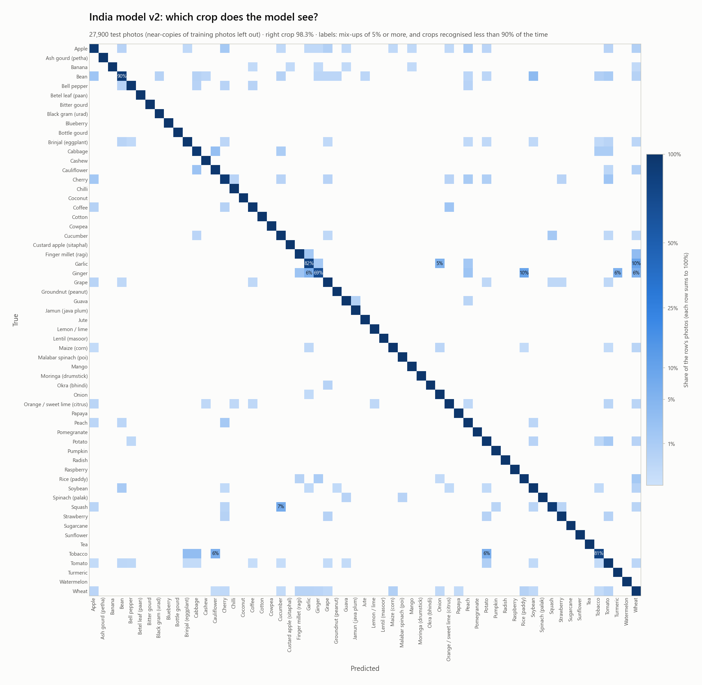
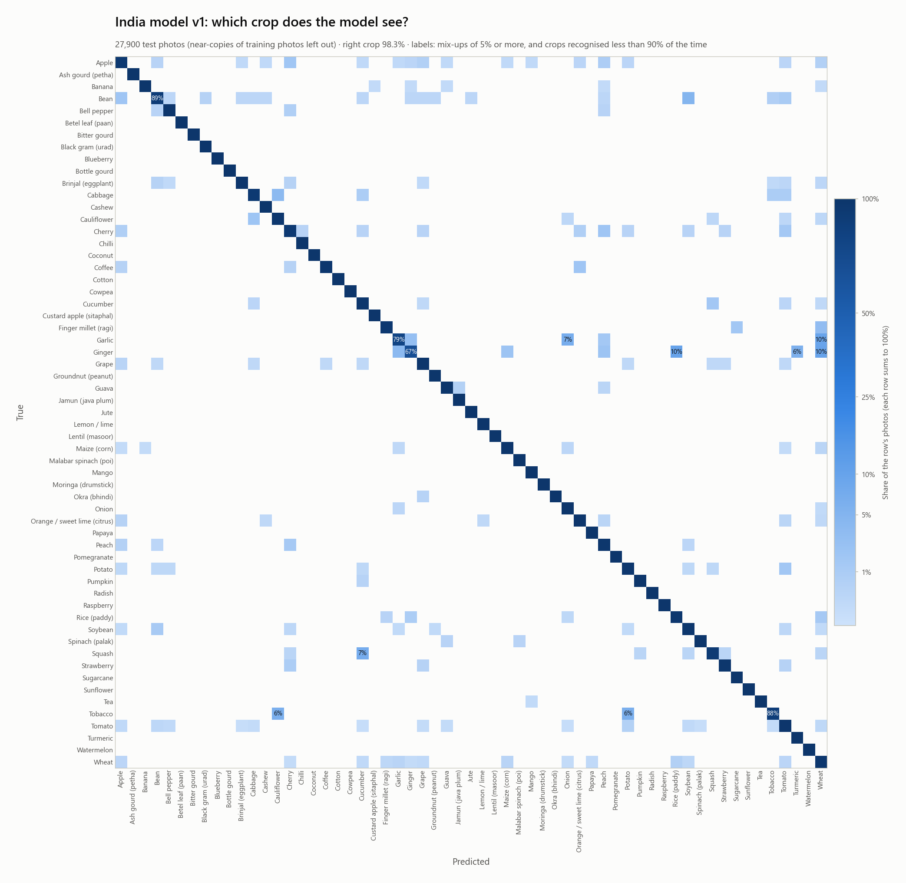

# AgriSmart India: multi-crop model

A second, much larger model covering **59 crops grown in India, with 387 disease/condition classes**.
It is built alongside the hackathon's core model but kept fully separate, so it can never affect the
core score.

- **Dataset build:** [`model/training/india/01_data_prep`](../training/india/01_data_prep) pulls **80
  sources**:
  - PlantVillage (lab photos)
  - PlantWild v1 + v2 (field photos, about 25 crops)
  - 64 Hugging Face `Project-AgML` mirrors of published research datasets
  - 14 Kaggle sets

  Many of the sources were photographed in Indian fields: Tomato-Village, Indian onion, Assam tea
  (TeaLeafNet), okra yellow vein mosaic, Maharashtra soybean, Kashmir apple, Karnataka coconut,
  pomegranate, rice and black gram. A **universal leakage guard** then runs over every photo:
  - Exact copies are merged, and copies that carry conflicting labels are dropped.
  - Near-copies are clustered, and each cluster is kept whole on one side of the 85/15 split.
  - Both checks use a perceptual hash plus a flip-invariant DINOv2 embedding.
- **Training:** [`model/training/india/02_train`](../training/india/02_train) trains one flat DINOv2
  ViT-B/14 classifier over every crop's classes, the same two-stage way as the core model (linear probe,
  then fine-tune). Target: **macro-F1 ≥ 0.95**, counted on the *clean* test set: the test photos with
  no training photo at DINOv2 cosine ≥ 0.95, as re-checked by the training notebook's leakage audit.
  Results are also reported for the whole test set, with the crop given, and per photo type
  (lab / field / mixed).

## Dataset (build of 12 Sep 2026)

| | train | test |
|---|---:|---:|
| **All photos** | 238,028 | 28,328 |
| Lab (PlantVillage) | 35,474 | 4,853 |
| Field (PlantWild) | 17,317 | 2,983 |
| Mixed (research datasets, mostly field) | 185,237 | 20,492 |

How the build got there:
- 351,802 photos were loaded.
- 65,473 exact copies were merged. Many sources ship pre-augmented duplicates.
- 3,008 copies carrying conflicting labels were dropped.
- Each class was capped at 3,000 photos, shared fairly between sources.
- 4 classes with fewer than 30 photos were dropped.

The build takes 65 minutes on a Kaggle T4. Photos are stored at 384 px, 6.7 GB in total.

Licences vary. Most sources are CC BY 4.0 or CC0; some are non-commercial (PlantVillage, PlantWild,
the Ripon cotton set, one tea set, MoringaLeafNet and the mango set). This model is for
non-commercial research and education, and the photos themselves are not redistributed.
- **Crop-conditioned inference:** at prediction time, giving a crop name restricts the answer to that
  crop's own classes — no retraining needed for that; see `model/india/predict.py` (written by the
  training notebook) and its `crop_classes` mapping in `model.pt`.
- **App:** [`server/live_camera_india/live_camera_india.py`](../../server/live_camera_india/live_camera_india.py) —
  a live camera / photo-upload page with a crop picker, what to do for each disease, and spoken results in
  12 Indian languages plus English (see
  [`server/live_camera_india/india_translations.json`](../../server/live_camera_india/india_translations.json)).
  Until `model/india/model.pt` exists, it runs in a clearly labelled **mock mode** over the same taxonomy,
  so the whole app can be built and tested before training finishes.

Weights are not stored in git; see `model/india/weights.json` (added once the model is trained) for the
GitHub Release download, the same pattern as `model/weights.json` for the core model.

## Results: model v1 (12 Sep 2026)

This is DINOv2 ViT-B/14 at 224 px, trained with 2 linear-probe epochs and then 14 fine-tune epochs
of 80k class-balanced draws each. The run took 4.8 h on a Kaggle T4. The full scores are in
[`metrics.json`](metrics.json), [`report_per_crop.csv`](report_per_crop.csv) and
[`report_per_class.csv`](report_per_class.csv).

| Test set | photos | macro-F1 | accuracy |
|---|---:|---:|---:|
| **Clean test (headline)** | 27,900 | **0.906** | 0.929 |
| Clean test, crop chosen in the app | 27,900 | **0.926** | 0.942 |
| Lab photos (PlantVillage) | 4,853 | 0.997 | 0.996 |
| Research-dataset photos, clean part | 20,144 | 0.926 | 0.940 |
| Field photos (PlantWild) | 2,983 | 0.744 (0.857 with the crop chosen) | 0.747 |

- **Target:** not met. The target is macro-F1 ≥ 0.95 on the clean test.
- **v2 attempt (13 Sep 2026), not adopted.** It used 336 px, layer-wise learning-rate decay 0.85 and
  weight EMA, with 6 fine-tune epochs continued from v1 (4.4 h on a T4). It did not improve:

  | | v1 | v2 |
  |---|---:|---:|
  | Clean macro-F1 | 0.906 | 0.902 |
  | With the crop chosen | 0.926 | 0.923 |
  | Field photos | 0.744 | 0.741 |

  v1 stays the released model. The plateau points to the data (few field photos for some classes),
  not to image resolution.
- **Leakage audit:** 428 of the 28,328 test photos (1.5%) have a training photo at DINOv2 cosine
  ≥ 0.95. Those photos are left out of the clean number.
- **Weakest crops by macro-F1:** ginger 0.61, ash gourd 0.69, okra 0.75, spinach 0.76,
  cauliflower 0.78. Most of these are field-photo classes with few examples. The model tells field
  photos apart much less reliably than lab photos. Choosing the crop in the app helps most exactly
  there.

### Confusion matrices

Drawn from each run's saved test predictions (one row per test photo:
[`test_predictions_v2.csv`](test_predictions_v2.csv) for v2, [`test_predictions.csv`](test_predictions.csv)
for v1) by [`model/training/india/03_eval/india_confusion.py`](../training/india/03_eval/india_confusion.py)
(`--model v2` or `--model v1`). Each row is a true crop and sums to 100%; the dark diagonal is right answers.

**Latest model, v2** ([crops](../../report/figures/india_v2_confusion_crops.png) ·
[field photos](../../report/figures/india_v2_confusion_crops_field.png) ·
[all 387 classes](../../report/figures/india_v2_confusion_full.png) ·
[top 30 mix-ups](../../report/results/india_v2_top_confusions.csv)):



- Right crop for **98.3%** of the 27,900 clean test photos (exact class 92.7%), and **86.6%** of the field
  photos (exact 74.7%).
- Hardest crops: ginger 69%, tobacco 81%, garlic 82%, bean 90%, squash 91%.
- Most frequent mix-ups: healthy brinjal taken for mosaic virus (57 photos), groundnut tikka leaf spot taken
  for healthy (30), healthy lentil taken for Ascochyta blight (24), healthy brinjal taken for insect damage
  (22), lentil powdery mildew taken for healthy (21).

**Released model, v1**, below:



- **Right crop for 98.3%** of the 27,900 clean test photos, and 86.5% of the field photos
  ([field-only matrix](../../report/figures/india_v1_confusion_crops_field.png)).
- **Hardest crops:** ginger is recognised 67% of the time (10% taken for wheat, 10% for rice, 6% for
  turmeric), garlic 79% (10% wheat, 7% onion), tobacco 88% (6% cauliflower, 6% potato), bean 89% and
  squash 92% (7% cucumber). In field photos, bean drops to 58% (19% taken for soybean) and squash to 71%
  (25% cucumber).
- **Within a crop** the classes are shown in the
  [all-387-class matrix](../../report/figures/india_v1_confusion_full.png). The most frequent mix-ups
  ([top 30](../../report/results/india_v1_top_confusions.csv)) are:

  | True | Predicted as | photos | share of the true class |
  |---|---|---:|---:|
  | Brinjal, healthy | Brinjal, mosaic virus | 56 | 16.5% |
  | Groundnut, tikka leaf spot | Groundnut, healthy | 27 | 10.2% |
  | Lentil, powdery mildew | Lentil, healthy | 24 | 14.0% |
  | Lentil, healthy | Lentil, Ascochyta blight | 21 | 8.8% |
  | Squash, powdery mildew | Cucumber, powdery mildew | 19 | 6.4% |

**Weights.** They are stored in GitHub Release `india-model-v1` (344 MB). See
[`weights.json`](weights.json) for the URL and SHA-256. To switch the live-scan app from mock mode to
the real model, download them into this folder:

```bash
gh release download india-model-v1 -R wpzvqrs8/SIH_2026 -p model.pt -D model/india
```

## Translations

`server/live_camera_india/india_translations.json` covers every crop and class above. It is a first
draft, not reviewed by native speakers. Crop names and
interface text are hand-translated with normal confidence. Disease/condition names are fully translated
for Hindi, Bengali, Marathi, Tamil, Telugu and Gujarati; for the other six languages (Urdu, Kannada,
Odia, Malayalam, Punjabi, Assamese) they are phonetic renderings of the English term in the local
script — a defensible starting point, not vernacular coinages. Treat both as a draft for a native-speaker
review, the same standard set for the Android app spec (`docs/android_app_prompt.md`, section 8.5).
